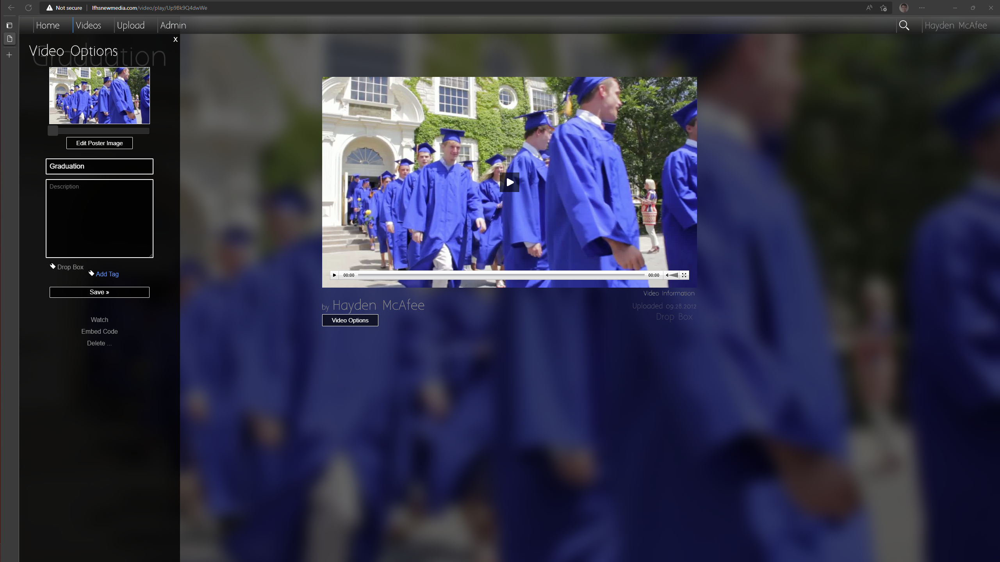

# LFHSNewMedia.com Website Archive

This repository contains the code that powered the LFHSNewMedia.com website from 2009 to 2022.

The website was written by Hayden McAfee as a high school student to provide a platform for
the Lake Forest High School New Media program to host and share content generated by students.

It continued to be used for hosting thousands of student videos for 10+ years until it was
retired in 2022.

Technologies used include:

- PHP + CodeIgniter framework
- MySQL relational database
- JavaScript for interactive pages
- Cufon because custom fonts in a browser used to be hard
- JW Player for video playback
- FFmpeg for transcoding and thumbnail generation
- Amazon S3 for video storage
- Amazon Cloudfront for video CDN
- Amazon EC2 for VPS

# Screenshots

